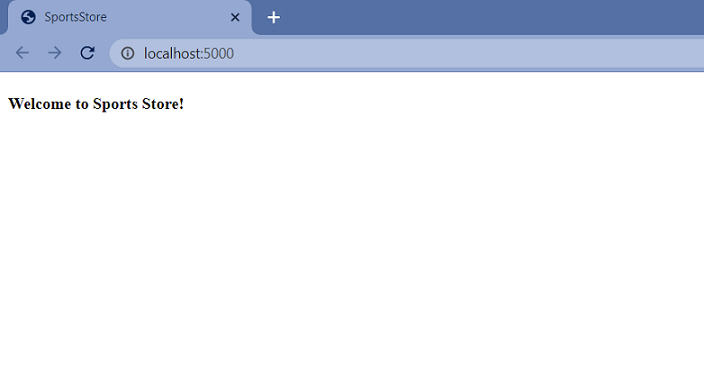

#  Sports Store Application. Step 0.

## Description

Building the basic infrastructure for the SportsStore application.

## Implementation details

<details><summary>

 **Creating the Project**

</summary>    

- Fork this repository.

- Clone the remote repository from GitLab to your local drive and go to the cloned repository.

```
$ git clone https://gitlab.com/UserName/sports-store-application.git

$ cd sports-store-application

```
- Switch to the `sports-store-application-0` branch.

```
$ git checkout sports-store-application-0

```

- Create a new solution `SportsStore` in the directory of the cloned repository.

```
$ dotnet new sln --name SportsStore

```
- Create `SportsStore` `ASP.NET Core Empty Application` in the directory of the cloned repository.

```
$ dotnet new web --no-https --name SportsStore

```
- Add the `SportsStore` project to the `SportsStore` solution.

```
$ dotnet sln add SportsStore/SportsStore.csproj

```
- Add `StyleCop.Analyzers` package to the `SportsStore/SportsStore.csproj`.

```
$ dotnet add package StyleCop.Analyzers

```
- Change the project file `SportsStore/SportsStore.csproj` by adding settings `code-analysis.ruleset` for `StyleCop` to it.

```
. . .
  <PropertyGroup>
    <TargetFramework>net6.0</TargetFramework>
    <Nullable>enable</Nullable>
    <ImplicitUsings>enable</ImplicitUsings>	
  ➥<CodeAnalysisRuleSet>..\code-analysis.ruleset</CodeAnalysisRuleSet>
  </PropertyGroup>>
. . .
```
- Enable the built-in .NET 6 code analyzer settings and add additional settings like this:

```
<Project Sdk="Microsoft.NET.Sdk.Web">
    <PropertyGroup>
        <TargetFramework>net6.0</TargetFramework>
        <ImplicitUsings>enable</ImplicitUsings>
        <Nullable>enable</Nullable>
        <EnableNETAnalyzers>true</EnableNETAnalyzers>
        <AnalysisMode>AllEnabledByDefault</AnalysisMode>
        <CodeAnalysisTreatWarningsAsErrors>false</CodeAnalysisTreatWarningsAsErrors>
        <CodeAnalysisRuleSet>..\code-analysis.ruleset</CodeAnalysisRuleSet>
        <GenerateDocumentationFile>false</GenerateDocumentationFile>
        <NoWarn>SA1600,CS1591,SA1200,SA1633,SA1000</NoWarn>
        <CodeAnalysisTreatWarningsAsErrors>false</CodeAnalysisTreatWarningsAsErrors>
    </PropertyGroup>>

. . .
</Project>
```
- Continue your work in Visual Studio or ather IDE.

- If you are using Visual Studio, click the `Open a project or solution` button on the splash screen or select `File` > `Open` > `Project/Solution`. Select the `SportsStore.sln` file in the `SportsStore` folder and click the Open button to open the project.

- To configure the HTTP port that ASP.NET Core will use to listen for HTTP requests, make the changes shown to the `launchSettings.json` file in the `SportsStore/Properties` folder as shown below:

```
{
  "iisSettings": {
    "windowsAuthentication": false,
    "anonymousAuthentication": true,
    "iisExpress": {
      "applicationUrl": "http://localhost:5000",
      "sslPort": 0
    }
  },
  "profiles": {
    "SportsStore": {
      "commandName": "Project",
      "dotnetRunMessages": true,
      "launchBrowser": true,
      "applicationUrl": "http://localhost:5000",
      "environmentVariables": {
        "ASPNETCORE_ENVIRONMENT": "Development"
      }
    },
    "IIS Express": {
      "commandName": "IISExpress",
      "launchBrowser": true,
      "environmentVariables": {
        "ASPNETCORE_ENVIRONMENT": "Development"
      }
    }
  }
}
```
- Create folders that will contain the application’s components. Right-click the `SportsStore` item in the Visual Studio Solution Explorer and select `Add` > `New` > `Folder` to create the set of folders described in this table:

| Folder Name | Description |
| ------ | ------ |
| `Models` | This folder will contain the data model and the classes that provide access to the data in the application’s database |
| `Controllers` | This folder will contain the controller classes that handle HTTP requests. |
| `Views` | This folder will contain all the Razor files, grouped into separate subfolders. |
| `Views/Home` | This folder will contain Razor files that are specific to the Home controller. |
| `Views/Shared` | This folder will contain Razor files that are common to all controllers.|

- To prepare application services and the request pipeline, change the `Program.cs` file as shown below: 

```
  var builder = WebApplication.CreateBuilder(args);
  
➥builder.Services.AddControllersWithViews();
  
  var app = builder.Build();
  
➥app.UseStaticFiles();
  
➥app.MapDefaultControllerRoute();
  
  app.Run();

```
- Add the `_Layout.cshtml` Razor Layout View file to the `Views/Shared` folder. You can use the layout generated by default or this markup:
```
<!DOCTYPE html> 
<html> 
<head> 
    <meta name="viewport" content="width=device-width" /> 
    <title>SportsStore</title> 
</head> 
<body> 
    <div> 
        @RenderBody() 
    </div> 
</body> 
</html>
``` 
- To configure the Razor View Engine, add the `_ViewImports.cshtml` Razor View file in the `SportsStore/Views` folder with following content:
```
@addTagHelper *, Microsoft.AspNetCore.Mvc.TagHelpers
```
- Add a `_ViewStart.cshtml` Razor View Start file to the `SportsStore/Views` folder with the content shown below.
```
@{
    Layout = "_Layout";
} 
```
- If it was not generated by a template, add the `HomeController` class in the `HomeController.cs` file to the `SportsStore/Controllers` folder.
```
using Microsoft.AspNetCore.Mvc;

namespace SportsStore.Controllers
{
  ➥public class HomeController : Controller
    {
      public IActionResult Index() => View();
    }
}

```
- Add the `Index.cshtml` Razor View file to the `SportsStore/Views/Home` folder if it does not exist.

```
<h4>Welcome to Sports Store!</h4>

```
- Build project, run application and request http://localhost:5000.

```
$ dotnet build
$ dotnet run
```


- Add and view changes and than commit.

```
$ git status
$ git add .
$ git diff --staged
$ git commit -m "Add initial version of SportsStore App."

```
- Push the local branch to the remote branch.

```
$ git push --set-upstream origin sports-store-application-0

```
- Switch to the `main` branch and do a fast-forward merge according to changes from the `sports-store-application-0` branch.

```
$ git checkout main

$ git merge sports-store-application-0 --ff
```
- Push the changes from the local `main` branch to the remote branch.

```
$ git push
```
- Go to the `Sports Store Application. Step 1.` (branch `sports-store-application-1`).

</details>

## Additional Materials

<details><summary>References
</summary> 

1. [Minimal APIs overview](https://docs.microsoft.com/en-us/aspnet/core/fundamentals/minimal-apis?view=aspnetcore-6.0)
1. [Get started with ASP.NET Core MVC](https://docs.microsoft.com/en-us/aspnet/core/tutorials/first-mvc-app/start-mvc?view=aspnetcore-6.0&tabs=visual-studio)
1. [Controllers](https://jakeydocs.readthedocs.io/en/latest/mvc/controllers/index.html)
1. [Views](https://jakeydocs.readthedocs.io/en/latest/mvc/views/index.html)

</details>

</details>

<details><summary>[Pro ASP.NET Core 6. Develop Cloud-Ready Web Applications Using MVC, Blazor, and Razor Pages 9th ed. Edition by Adam Freeman](https://www.amazon.com/Pro-ASP-NET-Core-Cloud-Ready-Applications/dp/1484279565/). 
</summary> 

1. Part Ⅰ. Chapeter 7. SportsStore: A Real Application.
1. Part Ⅱ. Chapeter 12. Creating the Example Project.
1. Part Ⅲ. Chapeter 18. Understanding the ASP.NET Core Platform.

</details>
