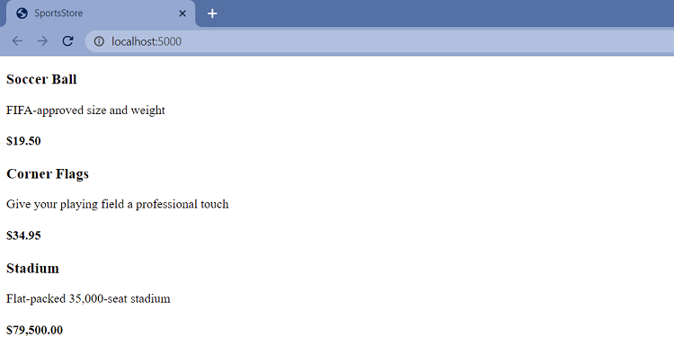
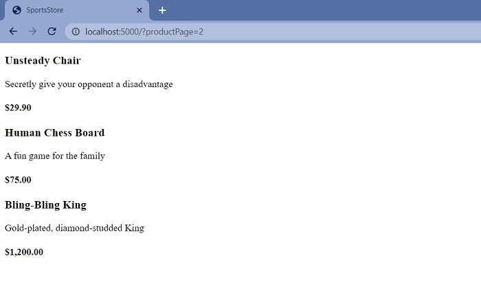
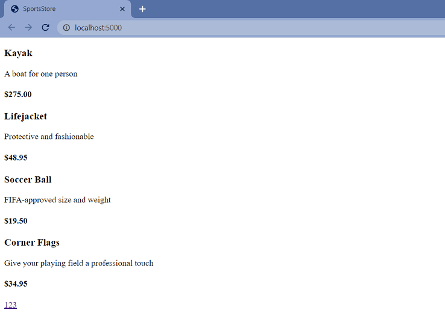
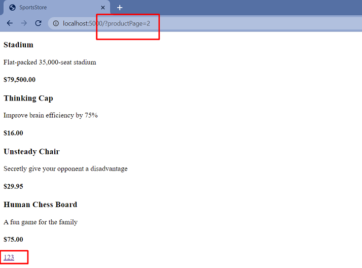
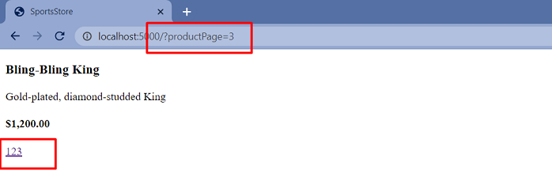
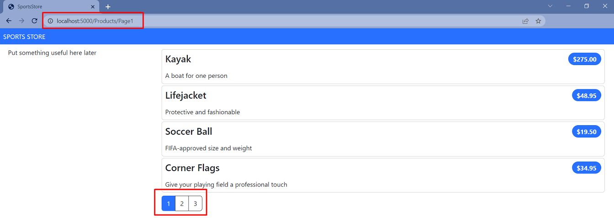

#  Sports Store Application. Step 1.

## Implementation details

<details>
<summary>

**Adding Data to the Application**

</summary>

- Go to the cloned repository of the previous step `Sport Store Application. Part 0`. 

- Switch to the `sports-store-application-1` branch and do a fast-forward merge according to changes from the `main` branch.

```
$ git checkout sports-store-application-1

$ git merge main --ff

```
- Continue your work in Visual Studio or ather IDE.

- Builed project, run application and request http://localhost:5000/. Your app should be work.


- Add the `Product` class in the `Product.cs` file to the `SportsStore/Models` folder. Import the required dependencies. 
```
using System.ComponentModel.DataAnnotations.Schema;

namespace SportsStore.Models
{
    public class Product
    {
        public long ProductId { get; set; }

        public string Name { get; set; } = string.Empty;

        public string Description { get; set; } = string.Empty;

        [Column(TypeName = "decimal(8, 2)")]

        public decimal Price { get; set; }

        public string Category { get; set; } = string.Empty;
    }
}

```

- Add the Entity Framework Core Packages to the SportsStore Project. 

```
$ dotnet add package Microsoft.EntityFrameworkCore.Design --version 6.0.0
$ dotnet add package Microsoft.EntityFrameworkCore.SqlServer --version 6.0.0

(Optional) 
$ dotnet tool uninstall --global dotnet-ef
$ dotnet tool install --global dotnet-ef --version 6.0.0
```

- To define the connection string, add the configuration setting in the `appsettings.json` file in the `SportsStore` folder:

```
{
    "Logging": {
        "LogLevel": {
        "Default": "Information",
        "Microsoft": "Warning",
        "Microsoft.Hosting.Lifetime": "Information"
        }
    },
    "AllowedHosts": "*",
    "ConnectionStrings": {
    "SportsStoreConnection": "Server=(localdb)\\MSSQLLocalDB;Database=SportsStore;MultipleActiveResultSets=true"
    }
}

```
- Add the `StoreDbContext` context class in the `StoreDbContext.cs` file to the `SportsStore/Models` folder.

```
using Microsoft.EntityFrameworkCore;

public class StoreDbContext: DbContext 
{
    public StoreDbContext(DbContextOptions<StoreDbContext> options)
        : base(options) { }

    public DbSet<Product> Products => Set<Product>();
}
```
- To configure Entity Framework Core, add the following code to the `Program` file: 

```
using Microsoft.EntityFrameworkCore;
using SportsStore.Models;

var builder = WebApplication.CreateBuilder(args);

builder.Services.AddControllersWithViews();

builder.Services.AddDbContext<StoreDbContext>(opts => {
    opts.UseSqlServer(
        builder.Configuration["ConnectionStrings:SportsStoreConnection"]);
});

var app = builder.Build();

app.UseStaticFiles();

app.MapDefaultControllerRoute();

app.Run();
```

- Create the `IStoreRepository` interface in the `SportsStore/Models/Repository` folder.

```
namespace SportsStore.Models.Repository
{
    public interface IStoreRepository
    {
        IQueryable<Product> Products { get; }
    }
}

```

- Create the `EFStoreRepository` class in the `SportsStore/Models/Repository` folder

```
namespace SportsStore.Models.Repository
{
    public class EFStoreRepository : IStoreRepository
    {
        private StoreDbContext context;

        public EFStoreRepository(StoreDbContext ctx)
        {
            this.context = ctx;
        }

        public IQueryable<Product> Products => this.context.Products;
    }
}

```

- Add `RepositoryService` to the Program.cs file shown below: 

```
using Microsoft.EntityFrameworkCore;
using SportsStore.Models;
...

builder.Services.AddDbContext<StoreDbContext>(opts => {
    opts.UseSqlServer(
        builder.Configuration["ConnectionStrings:SportsStoreConnection"]);
});

builder.Services.AddScoped<IStoreRepository, EFStoreRepository>(); 

...

app.Run();
```

- Add a database migration.

```
$ dotnet ef migrations add Initial

```

- To populate the database and provide some sample data, add a class file called `SeedData.cs` to the `Models/Data` folder.

```
using Microsoft.EntityFrameworkCore;

namespace SportsStore.Models
{
    public static class SeedData
    {
        public static void EnsurePopulated(IApplicationBuilder app)
        {
            StoreDbContext context = app.ApplicationServices
                        .CreateScope().ServiceProvider.GetRequiredService<StoreDbContext>();

            if (context.Database.GetPendingMigrations().Any())
            {
                context.Database.Migrate();
            }

            if (!context.Products.Any())
            {
                context.Products.AddRange(
                    new Product
                    {
                        Name = "Kayak",
                        Description = "A boat for one person",
                        Category = "Watersports",
                        Price = 275,
                    },
                    new Product
                    {
                        Name = "Lifejacket",
                        Description = "Protective and fashionable",
                        Category = "Watersports",
                        Price = 48.95m,
                    },
                    new Product
                    {
                        Name = "Soccer Ball",
                        Description = "FIFA-approved size and weight",
                        Category = "Soccer",
                        Price = 19.50m,
                    },
                    new Product
                    {
                        Name = "Corner Flags",
                        Description = "Give your playing field a professional touch",
                        Category = "Soccer",
                        Price = 34.95m,
                    },
                    new Product
                    {
                        Name = "Stadium",
                        Description = "Flat-packed 35,000-seat stadium",
                        Category = "Soccer",
                        Price = 79500,
                    },
                    new Product
                    {
                        Name = "Thinking Cap",
                        Description = "Improve brain efficiency by 75%",
                        Category = "Chess",
                        Price = 16,
                    },
                    new Product
                    {
                        Name = "Unsteady Chair",
                        Description = "Secretly give your opponent a disadvantage",
                        Category = "Chess",
                        Price = 29.95m,
                    },
                    new Product
                    {
                        Name = "Human Chess Board",
                        Description = "A fun game for the family",
                        Category = "Chess",
                        Price = 75,
                    },
                    new Product
                    {
                        Name = "Bling-Bling King",
                        Description = "Gold-plated, diamond-studded King",
                        Category = "Chess",
                        Price = 1200,
                    }
                );

                context.SaveChanges();
            }
        }
    }
}

```

- To seed the database when the application starts, add a call to the `EnsurePopulated` method from the `Progrem` file.

```
using Microsoft.EntityFrameworkCore;
using SportsStore.Models;
...

var builder = WebApplication.CreateBuilder(args);

...

SeedData.EnsurePopulated(app);

app.Run();

```

*_If you need to reset the database, then run this command in the SportsStore folder:_

```
$ dotnet ef database drop --force --context StoreDbContext

```
- Build project, add and view changes and than commit.

```
$ dotnet build
$ git status
$ git add *.cs *.json *.proj
$ git diff --staged
$ git commit -m "Add data to application."

```

</details> 

<details>
<summary>

**Displaying a List of Products**

</summary>   

- Change the `HomeController` class according to following code.

```
using Microsoft.AspNetCore.Mvc;
using SportsStore.Models.Repository;

namespace SportsStore.Controllers
{
    public class HomeController : Controller
    {
        private readonly IStoreRepository repository;

        public HomeController(IStoreRepository repository)
        {
            this.repository = repository;
        }

        public IActionResult Index() => View(repository.Products);
    }
}
```
- Update `Index.cshtml` file in the `SportsStore/Views/Home` folder.

```
@model IQueryable<Product>

@foreach (var p in Model ?? Enumerable.Empty<Product>()) 
{
    <div>
        <h3>@p.Name</h3>
        @p.Description
        <h4>@p.Price.ToString("c")</h4>
    </div>
}
```

- Build the solution. Restart ASP.NET Core and request http://localhost:5000



- Add and view changes and than commit.

```
$ dotnet build
$ dotnet run
$ git status
$ git add *.cs *.cshtml
$ git diff --staged
$ git commit -m "Add displaying a list of products."
```

</details> 

<details>
<summary>

**Adding Pagination**

</summary>  

- To add pagination, change the `Controller` class by adding following code.
```
...
private const int PageSize = 4; 
...
public ViewResult Index(int productPage = 1)
    => this.View(this.repository.Products
      .OrderBy(p => p.ProductId)
      .Skip((productPage - 1) * PageSize)
      .Take(PageSize));
...
```

- Restart application and request http://localhost:5000. To view another page, append query string parameters to the end of the URL like this http://localhost:5000/?productPage=2



- Create the `PagingInfo` class in the `SportsStore/Models/ViewModels` folder.

```
namespace SportsStore.Models.VewModels
{
    public class PagingInfo
    {
        public int TotalItems { get; set; }

        public int ItemsPerPage { get; set; }

        public int CurrentPage { get; set; }

        public int TotalPages => (int)Math.Ceiling((decimal)TotalItems / ItemsPerPage);
    }
}
```

- Create the `Infrastructure` folder in the project.

- Create the `PageLinkTagHelper` tag helper class in the `SportsStore/Infrastructure` folder.

```
using Microsoft.AspNetCore.Mvc;
using Microsoft.AspNetCore.Mvc.Rendering;
using Microsoft.AspNetCore.Mvc.Routing;
using Microsoft.AspNetCore.Mvc.ViewFeatures;
using Microsoft.AspNetCore.Razor.TagHelpers;
using SportsStore.Models.ViewModels;

namespace SportsStore.Infrastructure
{
    [HtmlTargetElement("div", Attributes = "page-model")]
    public class PageLinkTagHelper : TagHelper
    {
        private IUrlHelperFactory urlHelperFactory;

        public PageLinkTagHelper(IUrlHelperFactory helperFactory)
        {
            urlHelperFactory = helperFactory;
        }

        [ViewContext]
        [HtmlAttributeNotBound]
        public ViewContext? ViewContext { get; set; }
        
        public PagingInfo? PageModel { get; set; }
        
        public string? PageAction { get; set; }

        public override void Process(TagHelperContext context, TagHelperOutput output)
        {
            if (ViewContext != null && PageModel != null)
            {
                IUrlHelper urlHelper = urlHelperFactory.GetUrlHelper(ViewContext);
                TagBuilder result = new TagBuilder("div");
                for (int i = 1; i <= PageModel.TotalPages; i++)
                {
                    TagBuilder tag = new TagBuilder("a");
                    tag.Attributes["href"] = urlHelper.Action(PageAction,
                        new { productPage = i });
                    tag.InnerHtml.Append(i.ToString());
                    result.InnerHtml.AppendHtml(tag);
                }

                output.Content.AppendHtml(result.InnerHtml);
            }
        }
    }
}

```

-  Register the `PageLinkTagHelper` tag helper in the `ViewImports.cshtml` File in the SportsStore/Views Folder

```
...
@using SportsStore.Models
@using SportsStore.Models.ViewModels
@addTagHelper *, Microsoft.AspNetCore.Mvc.TagHelpers
@addTagHelper *, SportsStore
```

- Add a `ProductsListViewModel` class in the `ProductsListViewModel.cs` file to the `Models/ViewModels` folder of the SportsStore project.

```
namespace SportsStore.Models.ViewModels
{
    public class ProductsListViewModel
    {
        public IEnumerable<Product> Products { get; set; } = Enumerable.Empty<Product>();

        public PagingInfo PagingInfo { get; set; } = new();
    }
}
```

- Update the `Index` action method in the `HomeController.cs` file in the `SportsStore/Controllers` folder.

```
. . .
using SportsStore.Models.ViewModels;
. . .

public ViewResult Index(int productPage = 1)
{
    return View(new ProductsListViewModel
    {
        Products = repository.Products
                       .OrderBy(p => p.ProductId)
                       .Skip((productPage - 1) * PageSize)
                       .Take(PageSize),
        PagingInfo = new PagingInfo
        {
            CurrentPage = productPage,
            ItemsPerPage = PageSize,
            TotalItems = repository.Products.Count(),
        },
    });
}
. . .
```
-  Update the `Index.cshtml` file.
```
@model ProductsListViewModel

@foreach (var p in Model?.Products ?? Enumerable.Empty<Product>())  
{
    <div>
        <h3>@p.Name</h3>
        @p.Description
        <h4>@p.Price.ToString("c")</h4>
    </div>
}
```

and add an HTML element that the tag helper will process to create the page links.

```
<div page-model="@Model?.PagingInfo" page-action="Index"></div>

```
- Build project, restart application and request http://localhost:5000.







- To improve the URL (while used http://localhost/?productPage=2), add a new route in the Program.cs file, that follows the pattern of composable URLs that make sense to a user: http://localhost/Page2:

```
var builder = WebApplication.CreateBuilder(args);

. . . 

app.MapControllerRoute(
    "pagination",
    "Products/Page{productPage}",
    new { Controller = "Home", action = "Index" });

. . .

app.Run();
```
- Add and view changes and than commit.

```
$ git status
$ git add *.cs *.cshtml *.proj
$ git diff --staged
$ git commit -m "Add pagination."
```

</details> 

<details>
<summary>

**Styling the Content**

</summary>  

- Configure the project to use the `Bootstrap` package to provide the CSS styles. Client-side packages are installed using `LibMan`. To install the `LibMan` Tool Package, use [Microsoft.Web.LibraryManager.Cli](https://www.nuget.org/packages/Microsoft.Web.LibraryManager.Cli/).

```
$ dotnet tool uninstall --global Microsoft.Web.LibraryManager.Cli
$ dotnet tool install --global Microsoft.Web.LibraryManager.Cli --version 2.1.113
```

- Run the following commands in the `SportsStore` folder:
```
$ libman init -p cdnjs
$ libman install bootstrap@5.2.0 -d wwwroot/lib/bootstrap
```

- Apply `Bootstrap CSS` to the `_Layout.cshtml` file in the `SportsStore/Views/Shared` folder.
```
<!DOCTYPE html>
<html>
<head>
    <meta name="viewport" content="width=device-width" />
    <title>SportsStore</title>
    <link href="/lib/bootstrap/css/bootstrap.min.css" rel="stylesheet" />
</head>
<body>
    <div class="bg-primary text-white p-2">
        <span class="navbar-brand ml-2">SPORTS STORE</span>
    </div>
    <div class="row m-1 p-1">
        <div id="categories" class="col-3">
            Put something useful here later
        </div>
        <div class="col-9">
            @RenderBody()
        </div>
    </div>
</body>
</html>
```

-  Style the content in the `Index.cshtml` file in the `SportsStore/Views/Home` folder.

```
@foreach (var p in Model?.Products ?? Enumerable.Empty<Product>())
{
    <div class="card card-outline-primary m-1 p-1">
        <div class="bg-faded p-1">
            <h4>
                @p.Name
                <span class="badge rounded-pill bg-primary text-white"
                  style="float:right">
                    <small>@p.Price.ToString("c")</small>
                </span>
            </h4>
        </div>
        <div class="card-text p-1">@p.Description</div>
    </div>
}

<div page-model="@Model?.PagingInfo" page-action="Index" page-classes-enabled="true"
     page-class="btn" page-class-normal="btn-outline-dark"
     page-class-selected="btn-primary" class="btn-group pull-right m-1">
</div>
```

- To style the buttons generated by the PageLinkTagHelper class, add properties to the `PageLinkTagHelper` class in the `PageLinkTagHelper.cs` file in the `SportsStore/Infrastructure` folder

```
public class PageLinkTagHelper : TagHelper
{
    ...
    public bool PageClassesEnabled { get; set; } = false;

    public string PageClass { get; set; } = string.Empty;

    public string PageClassNormal { get; set; } = string.Empty;

    public string PageClassSelected { get; set; } = string.Empty;

    ...

    public override void Process(TagHelperContext context, TagHelperOutput output)
    {
        ...
            for (int i = 1; i <= PageModel.TotalPages; i++)
            {
                . . .
                if (PageClassesEnabled)
                {
                    tag.AddCssClass(PageClass);
                    tag.AddCssClass(i == PageModel.CurrentPage
                        ? PageClassSelected : PageClassNormal);
                }
            }
        ...
    }
}
```

- Builed project, restart application and request http://localhost:5000.

- To simplify the `Index.cshtml` view, create a partial view. Add a Razor View called `_ProductSummary.cshtml` to the `Views/Shared` folder and add the markup.

```
@model Product

<div class="card card-outline-primary m-1 p-1">
    <div class="bg-faded p-1">
        <h4>
            @Model?.Name
            <span class="badge rounded-pill bg-primary text-white"
                  style="float:right">
                <small>@Model?.Price.ToString("c")</small>
            </span>
        </h4>
    </div>
    <div class="card-text p-1">@Model?.Description</div>
</div>
```

- Update the `Index.cshtml` file in the `Views/Home` folder. 

```
@model ProductsListViewModel

@foreach (var p in Model?.Products ?? Enumerable.Empty<Product>()) 
{
    <partial name="_ProductSummary" model="p" />
}

<div page-model="@Model?.PagingInfo" page-action="Index" page-classes-enabled="true"
    page-class="btn" page-class-normal="btn-outline-dark"
    page-class-selected="btn-primary" class="btn-group pull-right m-1">
</div>
```
- Builed project, run the application and request http://localhost:5000.




- Add and view changes and than commit.

```
$ git status
$ git add *.cs *.cshtml *.proj * *.json
$ git diff --staged
$ git commit -m "Add styling the content."
```

- Push the local branch to the remote branch.

```
$ git push --set-upstream origin sports-store-application-1

```
- Switch to the main branch and do a fast-forward merge according to changes from the sports-store-application-1 branch.

```
$ git checkout main

$ git merge sports-store-application-1 --ff
```
- Push the changes from the local main branch to the remote branch.

```
$ git push
```
- Go to the `Sports Store Application. Step 2.` (branch `sports-store-application-2`).

</details>

## Additional Materials

<details><summary>References
</summary> 

1. [Minimal APIs overview](https://docs.microsoft.com/en-us/aspnet/core/fundamentals/minimal-apis?view=aspnetcore-6.0)
1. [Get started with ASP.NET Core MVC](https://docs.microsoft.com/en-us/aspnet/core/tutorials/first-mvc-app/start-mvc?view=aspnetcore-6.0&tabs=visual-studio)
1. [Controllers](https://jakeydocs.readthedocs.io/en/latest/mvc/controllers/index.html)
1. [Views](https://jakeydocs.readthedocs.io/en/latest/mvc/views/index.html)
1. [Models](https://jakeydocs.readthedocs.io/en/latest/mvc/models/index.html)
1. [ASP.NET Core MVC with EF Core - tutorial series](https://docs.microsoft.com/en-us/aspnet/core/data/ef-mvc/?view=aspnetcore-6.0)
1. [Persist and retrieve relational data with Entity Framework Core](https://docs.microsoft.com/en-us/learn/modules/persist-data-ef-core/?view=aspnetcore-6.0)

</details>

<details><summary>Books
</summary> 

1. [Pro ASP.NET Core 6. Develop Cloud-Ready Web Applications Using MVC, Blazor, and Razor Pages 9th ed. Edition by Adam Freeman](https://www.amazon.com/Pro-ASP-NET-Core-Cloud-Ready-Applications/dp/1484279565/). Part 1. Chapeter 7. SportsStore: A Real Application.
1. [Pro ASP.NET Core 6. Develop Cloud-Ready Web Applications Using MVC, Blazor, and Razor Pages 9th ed. Edition by Adam Freeman](https://www.amazon.com/Pro-ASP-NET-Core-Cloud-Ready-Applications/dp/1484279565/). Part 3. Chapeter 18. Creating the Example Project.
1. [Pro ASP.NET Core 6. Develop Cloud-Ready Web Applications Using MVC, Blazor, and Razor Pages 9th ed. Edition by Adam Freeman](https://www.amazon.com/Pro-ASP-NET-Core-Cloud-Ready-Applications/dp/1484279565/). Part 3. Chapeter 21. Using Controllers with Views. Part I.
1. [Pro ASP.NET Core 6. Develop Cloud-Ready Web Applications Using MVC, Blazor, and Razor Pages 9th ed. Edition by Adam Freeman](https://www.amazon.com/Pro-ASP-NET-Core-Cloud-Ready-Applications/dp/1484279565/). Part 3. Chapeter 22. Using Controllers with Views. Part II.
1. [Pro ASP.NET Core 6. Develop Cloud-Ready Web Applications Using MVC, Blazor, and Razor Pages 9th ed. Edition by Adam Freeman](https://www.amazon.com/Pro-ASP-NET-Core-Cloud-Ready-Applications/dp/1484279565/). Part 3. Chapeter 23. Using Razor Pages.
1. [Pro ASP.NET Core 6. Develop Cloud-Ready Web Applications Using MVC, Blazor, and Razor Pages 9th ed. Edition by Adam Freeman](https://www.amazon.com/Pro-ASP-NET-Core-Cloud-Ready-Applications/dp/1484279565/). Part 3. Chapeter 25. Using Tag Helpers.

</details>
