#  Sports Store Application. Part 2

## Description

- Development the navigate by category. 
- Development the basic building blocks in place for adding items to a shopping cart.

## Implementation details

<details>
<summary>

**Adding Navigation Controls**

</summary>

- Go to the cloned repository of the previous step `Sport Store Application. Part 1`. 

- Switch to the `sports-store-application-2` branch and do a fast-forward merge according to changes from the `main` branch.

```
$ git checkout sports-store-application-2

$ git merge main --ff

```
- Continue your work in Visual Studio or other IDE.

- Builed project, run application and request http://localhost:5000/. All functionalities implemented in the previous step should work.

- Add the `CurrentCategory` property to the `ProductsListViewModel` class.

```
namespace SportsStore.Models.ViewModels
{
    public class ProductsListViewModel
    {
        public IEnumerable<Product> Products { get; set; } = null!;

        public PagingInfo PagingInfo { get; set; } = null!;

      ➥public string? CurrentCategory { get; set; }
    }
}
```
- Add the `Category` support to the `HomeController` class.

```
➥public ViewResult Index(string? category, int productPage = 1)
              => View(new ProductsListViewModel
              {
                  Products = repository.Products
                ➥.Where(p => category == null || p.Category == category)
                  .OrderBy(p => p.ProductId)
                  .Skip((productPage - 1) * PageSize)
                  .Take(PageSize),
                  PagingInfo = new PagingInfo
                  {
                      CurrentPage = productPage,
                      ItemsPerPage = PageSize,
                      TotalItems = repository.Products.Count(),
                  },
  
                ➥CurrentCategory = category,
              });
```

- Restart ASP.NET Core and select a category using the following URL http://localhost:5000/?category=Soccer. Make sure to use an uppercase `S` in `Soccer`.


- To improve the URLs like `/?category = Soccer`, change the routing configuration in the `Program` file. Create a more useful set of URLs. It is important to add the new routes in the order they are shown below.

```
...

app.MapControllerRoute(
    name: "pagination",
    pattern: "Products/Page{productPage:int}",
    defaults: new { Controller = "Home", action = "Index", productPage = 1 });

➥app.MapControllerRoute(
     name: "categoryPage",
     pattern: "{category}/Page{productPage:int}",
     defaults: new { Controller = "Home", action = "Index" });
  
➥app.MapControllerRoute(
    name: "category",
    pattern: "Products/{category}",
    defaults: new { Controller = "Home", action = "Index", productPage = 1 });

➥app.MapControllerRoute(
    name: "default",
    pattern: "/",
    defaults: new { Controller = "Home", action = "Index" });    

app.MapDefaultControllerRoute() 

SeedData.EnsurePopulated(app: app);

app.Run();
```

| URL | Route Name | Leads to |
| ------ | ------ | ------ |
| / | default | Shows the first page of products from all categories |
| /Products/Page2 | pagination | Shows the specified page (in this case, page 2), showing items from all categories |
| /Products/Soccer | category | Shows the first page of items from a specific category (in this case, the `Soccer` category) |
| /Soccer/Page1 | categoryPage | Shows the specified page (in this case, page 1) of items from the specified category (in this case, `Soccer`) |
| /Chess/Page1 | categoryPage | Shows the specified page (in this case, page 1) of items from the specified category (in this case, `Chess`) |

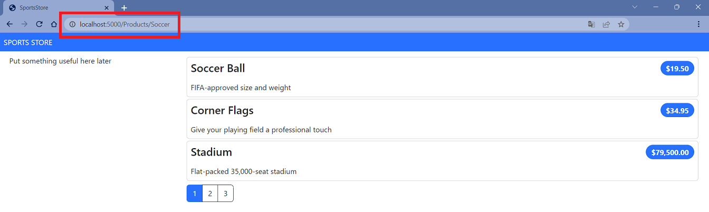

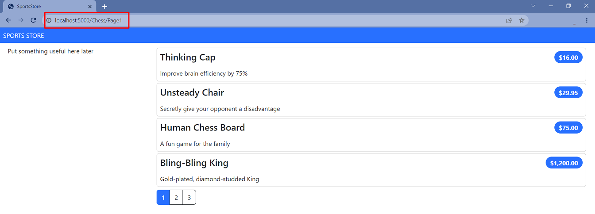
    
- To start generating more complex URLs, it's necessary to receive additional information from the view without having to add extra properties to the tag helper class. Add `Prefixed Values` in the `PageLinkTagHelper` to receive properties with a common prefix all together in a single collection.

```
[HtmlTargetElement("div", Attributes = "page-model")]
public class PageLinkTagHelper : TagHelper 
{
    . . . 
  ➥public string? PageRoute { get; set; }
  ➥[HtmlAttributeName(DictionaryAttributePrefix = "page-url-")]
  ➥public Dictionary<string, object> PageUrlValues { get; set; }  = new Dictionary<string, object>();
    . . .
    public override void Process(TagHelperContext context, TagHelperOutput output)
    {
        if (ViewContext != null && PageModel != null)
        {
            IUrlHelper urlHelper = urlHelperFactory.GetUrlHelper(ViewContext);
            TagBuilder result = new TagBuilder("div");
            for (int i = 1; i <= PageModel.TotalPages; i++)
            {
                TagBuilder tag = new TagBuilder("a");
              ➥PageUrlValues[key: "productPage"] = i;
              ➥tag.Attributes[key: "href"] = urlHelper.Action(action: PageAction, values: PageUrlValues);
              ➥tag.Attributes[key: "href"] = urlHelper.RouteUrl(routeName: PageRoute, values: PageUrlValues);
                if (PageClassesEnabled)
                {
                    tag.AddCssClass(PageClass);
                    tag.AddCssClass(i == PageModel.CurrentPage ? PageClassSelected : PageClassNormal);
                }
                tag.InnerHtml.Append(i.ToString());
                result.InnerHtml.AppendHtml(tag);
            }
            output.Content.AppendHtml(result.InnerHtml);
        }
    }
   . . . 
}
```
- Add a new attribute to the `Index.cshtml` Razor View file in the `SportsStore/Views/Home` folder.

```
  @model ProductsListViewModel
  
➥@{
      var route = this.Model.CurrentCategory is null ? "pagination" : "categoryPage";
  }
  
  @foreach (var p in Model?.Products ?? Enumerable.Empty<Product>())
  {
      <partial name="_ProductSummary" model="p" />
  }

➥<div page-model="@Model?.PagingInfo" page-classes-enabled="true" page-route=@route
       page-class="btn" page-class-normal="btn-outline-dark"
     ➥page-class-selected="btn-primary" page-url-category="@Model?.CurrentCategory!"
       class="btn-group pull-right m-1">
  </div>
```

- Restart ASP.NET Core and request http://localhost:5000/Soccer/Page1.

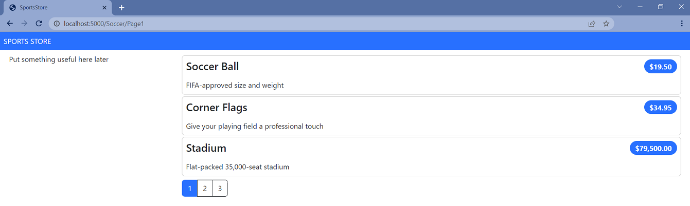

-  Сreate a folder called `Components`, which is the conventional home of View Components, in the `SportsStore` project.

-  Add the `NavigationMenuViewComponent` class to it.

```
using Microsoft.AspNetCore.Mvc;

namespace SportsStore.Components
{
  ➥public class NavigationMenuViewComponent : ViewComponent
    {
        public string Invoke()
        {
            return "Hello from the Navigation View Component";
        }
    }
}
```

- To view the result of the `Invoke` method, open the `_Layout.cshtml` Layout Razor View file and add the tag `<vc:navigation-menu />` as shown below: 

```
<!DOCTYPE html>
<html>
<head>
    <meta name="viewport" content="width=device-width" />
    <title>SportsStore</title>
    <link href="/lib/bootstrap/css/bootstrap.min.css" rel="stylesheet" />
</head>
<body>
    <div class="bg-primary text-white p-2">
        <span class="navbar-brand ml-2">SPORTS STORE</span>
    </div>
    <div class="row m-1 p-1">
        <div id="categories" class="col-3">
          ➥<vc:navigation-menu />
        </div>
        <div class="col-9">
            @RenderBody()
        </div>
    </div>
</body>
</html>
```
    
- Restart ASP.NET Core and request http://localhost:5000.


- Change the `NavigationMenuViewComponent` class by adding categories:

```
using Microsoft.AspNetCore.Mvc;
using SportsStore.Models.Repository;

namespace SportsStore.Components
{
    public class NavigationMenuViewComponent : ViewComponent
    {
      ➥private IStoreRepository repository;

      ➥public NavigationMenuViewComponent(IStoreRepository repository)
        {
            this.repository = repository;
        }

        public IViewComponentResult Invoke()
        {
          ➥return View(repository.Products
               .Select(x => x.Category)
               .Distinct()
               .OrderBy(x => x));
        }
    }
}
```

- Create the `Views/Shared/Components/NavigationMenu` folder in the `SportsStore` project and add to it to the `Default.cshtml` Razor View file.

```
@model IEnumerable<string>

<div class="d-grid gap-2">
    <a class="btn btn-outline-secondary" asp-route="default">
        Home
    </a>
    @foreach (string category in Model ?? Enumerable.Empty<string>())
    {
        <a class="btn btn-outline-secondary"
        asp-route="category" asp-route-category="@category">
            @category
        </a>
    }
</div>
```

- Restart ASP.NET Core and request http://localhost:5000.

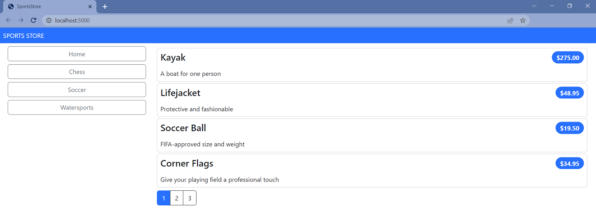

- Use the `RouteData` property in the `Invoke` method of `NavigationMenuViewComponent` to access the requested data in order to get the value for the currently selected category. 

```
public class NavigationMenuViewComponent : ViewComponent 
{
        ...
        public IViewComponentResult Invoke() 
        {
          ➥ViewBag.SelectedCategory = RouteData?.Values["category"];
            ...
        }
        ...
    }
}
```

- To highlight the selected categories, change the `Default.cshtml` file.

```
@model IEnumerable<string>

<div class="d-grid gap-2">
    <a class="btn btn-outline-secondary" asp-route="default">
        Home
    </a>
    @foreach (string category in Model ?? Enumerable.Empty<string>())
    {
        <a class="btn @(category == ViewBag.SelectedCategory ? "btn-primary": "btn-outline-secondary")"
           asp-route="category" asp-route-category="@category">
            @category
        </a>
    }
</div>
```
- Restart ASP.NET Core and request http://localhost:5000.

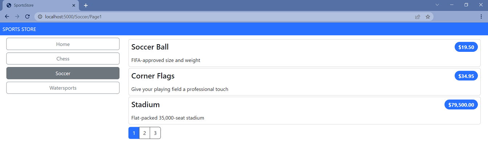

- Update the `Index` action method in the `Home` controller which will allow you to take into account the categories in the pagination (the functionality that breaks the selection result into pages). 

```
public ViewResult Index(string? category, int productPage = 1)
    => View(new ProductsListViewModel
    {
        Products = repository.Products
        .Where(p => category == null || p.Category == category)
        .OrderBy(p => p.ProductId)
        .Skip((productPage - 1) * PageSize)
        .Take(PageSize),
        PagingInfo = new PagingInfo
        {
            CurrentPage = productPage,
            ItemsPerPage = PageSize,
          ➥TotalItems = category == null ? repository.Products.Count() : repository.Products.Where(e => e.Category == category).Count(),
        }
        CurrentCategory = category,
    });
        
```
- Restart ASP.NET Core and request http://localhost:5000.

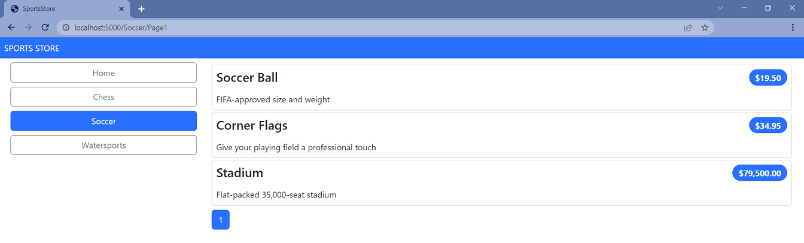

- Add and view changes and than commit.

```
$ git status
$ git add *.cs *.csproj *.cshtml
$ git diff --staged
$ git commit -m "Add navigation controls."
```

</details>

<details>
<summary>

**Building the Shopping Cart**

</summary>

- Add a new `_CartLayout.cshtml` Layout Razor View file to the `SportsStore/Views/Shared` folder for the`Cart` views.

```
<!DOCTYPE html>
<html>
<head>
    <meta name="viewport" content="width=device-width" />
    <title>SportsStore</title>
    <link href="/lib/bootstrap/css/bootstrap.min.css" rel="stylesheet" />
</head>
<body>
    <div class="bg-primary text-white p-2">
        <span class="navbar-brand ml-2">SPORTS STORE</span>
    </div>
    <div class="m-1 p-1">
        @RenderBody()
    </div>
</body>
</html>
```

- Add the `CartController.cs` class file to the `SportsStore/Controllers` folder.

```
namespace SportsStore.Controllers
{
  ➥public class CartController : Controller
    {
        public IActionResult Index()
        {
            return View();
        }
    }
}
```

- Add the `Index.cshtml` Razor View file to the `SportsStore/Views/Cart` folder.

```
@{
    this.Layout = "_CartLayout";
}

<h4>This is the Cart View</h4>
```

- To improve the routing add new "shoppingCart" route to the routing configuration to the `Program.cs` file.

```
  . . .
  
  app.MapControllerRoute(
      name: "pagination",
      pattern: "Products/Page{productPage:int}",
      defaults: new { Controller = "Home", action = "Index", productPage = 1 });
  
  app.MapControllerRoute(
      name: "categoryPage",
      pattern: "{category}/Page{productPage:int}",
      defaults: new { Controller = "Home", action = "Index" });

  app.MapControllerRoute(
    name: "category",
    pattern: "Products/{category}",
    defaults: new { Controller = "Home", action = "Index", productPage = 1 });
   
➥app.MapControllerRoute(
      name: "shoppingCart",
      pattern: "Cart",
      defaults: new { Controller = "Cart", action = "Index" });
  app.MapControllerRoute(
      name: "default",
      pattern: "/",
      defaults: new { Controller = "Home", action = "Index" });   
  . . .
```

- Restart ASP.NET Core and request http://localhost:5000/Cart.

    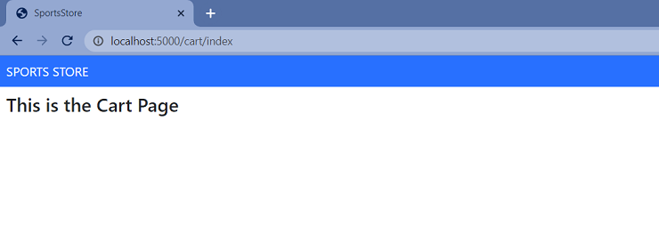

- To create the buttons that will add products to the cart, add the `UrlExtensions.cs` class file (in`Infrastructure` folder) and define the `PathAndQuery` extension method in the `UrlExtensions.cs` class.

```
namespace SportsStore.Infrastructure
{
  ➥public static class UrlExtensions
    {
        public static string PathAndQuery(this HttpRequest request)
            => request.QueryString.HasValue ? $"{request.Path}{request.QueryString}" : request.Path.ToString();
    }
}
```
The extension method generates a URL. The browser will return to this URL after the cart has been updated. If there are `Query Parameters` in the URL, they should be considered as well.  

- Add a `SportsStore.Infrastructure` namespace to the` _ViewImports.cshtml` file in the `SportsStore/Views` folder.

```
  @using SportsStore.Models
  @using SportsStore.Models.ViewModels
➥@using SportsStore.Infrastructure
  @addTagHelper *, Microsoft.AspNetCore.Mvc.TagHelpers
  @addTagHelper *, SportsStore
```
- Add the markup for the buttons into the `_ProductSummary.cshtml` Razor Partial View file in the `SportsStore/Views/Shared` folder.
        
```
@model Product

<div class="card card-outline-primary m-1 p-1">
    <div class="bg-faded p-1">
        <h4>
            @Model?.Name
            <span class="badge rounded-pill bg-primary text-white"
                  style="float:right">
                <small>@Model?.Price.ToString("c")</small>
            </span>
        </h4>
    </div>
  ➥<form id="@Model?.ProductId" asp-controller="Cart" asp-antiforgery="true">
        <input type="hidden" asp-for="ProductId" />
        <input type="hidden" name="returnUrl"
               value="@ViewContext.HttpContext.Request.PathAndQuery()" />
        <span class="card-text p-1">
            @Model?.Description
            <button type="submit"
                    class="btn btn-success btn-sm pull-right" style="float:right">
                Add To Cart
            </button>
        </span>
    </form>
</div>
```

- Use the session state mechanism to store information about a user’s cart. In order to do this, add services and middleware to the `Program.cs` file.

```
  . . .
  
  var builder = WebApplication.CreateBuilder(args);
  
  builder.Services.AddControllersWithViews();
  
  builder.Services.AddDbContext<StoreDbContext>(opts => {
      opts.UseSqlServer(builder.Configuration["ConnectionStrings:SportsStoreConnection"]);
  });

  builder.Services.AddScoped<IStoreRepository, EFStoreRepository>();
  
➥builder.Services.AddDistributedMemoryCache();
➥builder.Services.AddSession();

  var app = builder.Build();
  
  app.UseStaticFiles();

➥app.UseSession();

  . . .
  
  app.Run()
```

- To implement the cart feature, add the `Cart`class and the `CartLine` class (in files in the `Models` folder). 

```
namespace SportsStore.Models
{
  ➥public class Cart
    {
        private List<CartLine> lines = new List<CartLine>();

        public IReadOnlyList<CartLine> Lines { get { return lines; } }

        public void AddItem(Product product, int quantity)
        {
            CartLine? line = lines.
                Where(p => p.Product.ProductId == product.ProductId)
                .FirstOrDefault();

            if (line is null)
            {
                lines.Add(new CartLine
                {
                    Product = product,
                    Quantity = quantity,
                });
            }
            else
            {
                line.Quantity += quantity;
            }
        }

        public void RemoveLine(Product product)
            => lines.RemoveAll(l => l.Product.ProductId == product.ProductId);

        public decimal ComputeTotalValue()
            => lines.Sum(e => e.Product.Price * e.Quantity);

        public void Clear() => lines.Clear();
    }
}

namespace SportsStore.Models
{
  ➥public class CartLine
    {
        public int CartLineId { get; set; }

        public Product Product { get; set; } = new();

        public int Quantity { get; set; }
    }
}
```

The `Cart` class uses the `CartLine` class to represent a product selected by the customer and the quantity a user wants to buy. The `Cart` class includes the methods that add an item to the cart, remove a previously added item from the cart, calculate the total cost of the items in the cart, and reset the cart by removing all the items.

- To store a `Cart` object (the session state feature in ASP.NET Core stores only `int`, `string`, and `byte[]` values) define extension methods to the `ISession` interface that provides access to the session state data to serialize `Cart` objects into JSON and convert them back. Add the interface that provides access to the session state data to serialize `Cart` objects into JSON and convert them back. Add the `SessionExtensions.cs` class file to the `Infrastructure` folder and defined the extension methods. To serialization install the `Newtonsoft.json` package.

```
$ dotnet add package Newtonsoft.Json
```

```
using Newtonsoft.Json;

namespace SportsStore.Infrastructure
{
  ➥public static class SessionExtensions
    {
        public static void SetJson(this ISession session, string key, object value)
        {
            session.SetString(key, JsonConvert.SerializeObject(value));
        }

        public static T? GetJson<T>(this ISession session, string key)
        {
            var sessionData = session.GetString(key);
            return sessionData == null ? default(T) : JsonConvert.DeserializeObject<T>(sessionData);
        }
    }
}
```

- Add the `CartViewModel.cs` class file to the `SportsStore/Models/ViewModels` folder.

```
namespace SportsStore.Models.ViewModels
{
  ➥public class CartViewModel
    {
        public Cart? Cart { get; set; } = new();

        public string ReturnUrl { get; set; } = "/";
    }
}

```

- Change the `CartController` class.

```
using Microsoft.AspNetCore.Mvc;
using SportsStore.Infrastructure;
using SportsStore.Models;
using SportsStore.Models.Repository;
using SportsStore.Models.ViewModels;

namespace SportsStore.Controllers
{
    public class CartController : Controller
    {
      ➥private IStoreRepository repository;

      ➥public CartController(IStoreRepository repository)
        {
            this.repository = repository;
        }

        [HttpGet]
        public IActionResult Index(string returnUrl)
        {
          ➥return View(new CartViewModel
            {
                ReturnUrl = returnUrl ?? "/",
                Cart = HttpContext.Session.GetJson<Cart>("cart") ?? new Cart(),
            });
        }

        [HttpPost]
      ➥public IActionResult Index(long productId, string returnUrl)
        {
            Product? product = repository.Products.FirstOrDefault(p => p.ProductId == productId);

            if (product != null)
            {
                var cart = HttpContext.Session.GetJson<Cart>("cart") ?? new Cart();
                cart.AddItem(product, 1);
                HttpContext.Session.SetJson("cart", cart);
                return View(new CartViewModel { Cart = cart, ReturnUrl = returnUrl });
            }

            return RedirectToAction("Index", "Home");
        }
    }
}

```
- Change the `Index.cshtml` Razor View file in the `SportsStore/Views/Cart` folder.

```
➥@model CartViewModel
  
  @{
      this.Layout = "_CartLayout";
  }
  
➥<h2>Your cart</h2>
  <table class="table table-bordered table-striped">
    <thead>
        <tr>
            <th>Quantity</th>
            <th>Item</th>
            <th class="text-right">Price</th>
            <th class="text-right">Subtotal</th>
        </tr>
    </thead>
    <tbody>
        @foreach (var line in Model?.Cart?.Lines ?? Enumerable.Empty<CartLine>())
        {
            <tr>
                <td class="text-center">@line.Quantity</td>
                <td class="text-left">@line.Product.Name</td>
                <td class="text-right">@line.Product.Price.ToString("c")</td>
                <td class="text-right">
                    @((line.Quantity * line.Product.Price).ToString("c"))
                </td>
            </tr>
        }
    </tbody>
    <tfoot>
        <tr>
            <td colspan="3" class="text-right">Total:</td>
            <td class="text-right">
                @Model?.Cart?.ComputeTotalValue().ToString("c")
            </td>
        </tr>
    </tfoot>
  </table>
  <div class="text-center">
      <a class="btn btn-primary" href="@Model?.ReturnUrl">Continue shopping</a>
  </div>

```
- Restart ASP.NET Core and request http://localhost:5000. As a result, the basic functions of the shopping cart should be in place. First, products are listed along with the button that adds them to the cart. You can see that by restarting ASP.NET Core and requesting http://localhost:5000.  

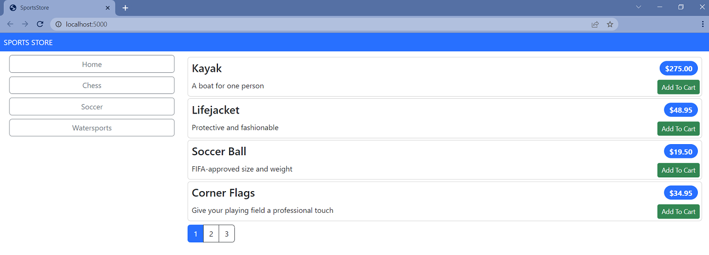

Then, when the user clicks the `Add To Cart` button, the selected product is added to their cart and the summary of the cart is displayed, as shown below
    
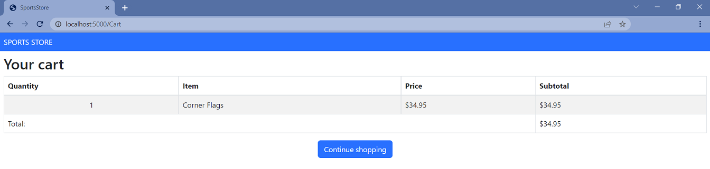

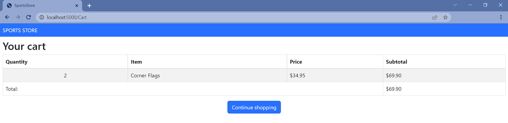

Clicking the `Continue Shopping button` returns the user to the product page they came from.

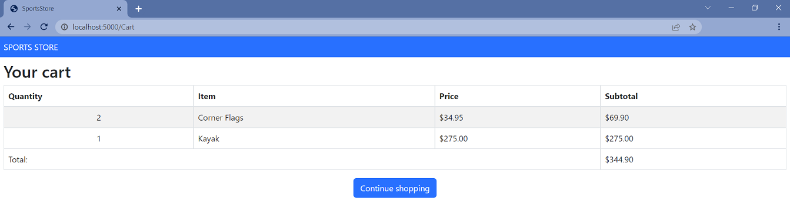

- Add and view changes and than commit.

```
$ git status
$ git add *.cs *.csproj *.cshtml
$ git diff --staged
$ git commit -m "Add shopping cart functionality."
```

- Push the local branch to the remote branch.

```
$ git push --set-upstream origin sports-store-application-2

```
- Switch to the `main` branch and do a merge according to changes from the `sports-store-application-2` branch.

```
$ git checkout main

$ git merge sports-store-application-2
```
- Push the changes from the local `main` branch to the remote branch.

```
$ git push

```
- Go to the `Sports Store Application. Step 3`. (branch `sports-store-application-3`).

</details>

## Additional Materials

<details><summary>References
</summary> 

1. [Minimal APIs overview](https://docs.microsoft.com/en-us/aspnet/core/fundamentals/minimal-apis?view=aspnetcore-6.0)
1. [Get started with ASP.NET Core MVC](https://docs.microsoft.com/en-us/aspnet/core/tutorials/first-mvc-app/start-mvc?view=aspnetcore-6.0&tabs=visual-studio)
1. [Controllers](https://jakeydocs.readthedocs.io/en/latest/mvc/controllers/index.html)
1. [Views](https://jakeydocs.readthedocs.io/en/latest/mvc/views/index.html)
1. [Models](https://jakeydocs.readthedocs.io/en/latest/mvc/models/index.html)
1. [ASP.NET Core MVC with EF Core - tutorial series](https://docs.microsoft.com/en-us/aspnet/core/data/ef-mvc/?view=aspnetcore-6.0)
1. [Persist and retrieve relational data with Entity Framework Core](https://docs.microsoft.com/en-us/learn/modules/persist-data-ef-core/?view=aspnetcore-6.0)

</details>

<details><summary>[Pro ASP.NET Core 6. Develop Cloud-Ready Web Applications Using MVC, Blazor, and Razor Pages 9th ed. Edition by Adam Freeman](https://www.amazon.com/Pro-ASP-NET-Core-Cloud-Ready-Applications/dp/1484279565/). 
</summary> 

1. Part Ⅰ. Chapeter 8. SportsStore: Navigation and Cart.
1. Part Ⅱ. Chapeter 13. Using URL Routing.
1. Part Ⅱ. Chapeter 16. Using the Platform Features, Part 2.
1. Part Ⅲ. Chapeter 18. Creating the Example Project.
1. Part Ⅲ. Chapeter 21. Using Controllers with Views. Part 1.
1. Part Ⅲ. Chapeter 22. Using Controllers with Views. Part 2.
1. Part Ⅲ. Chapeter 23. Using Razor Pages.
1. Part Ⅲ. Chapeter 24. Using View Components.
1. Part Ⅲ. Chapeter 25. Using Tag Helpers.

</details>
