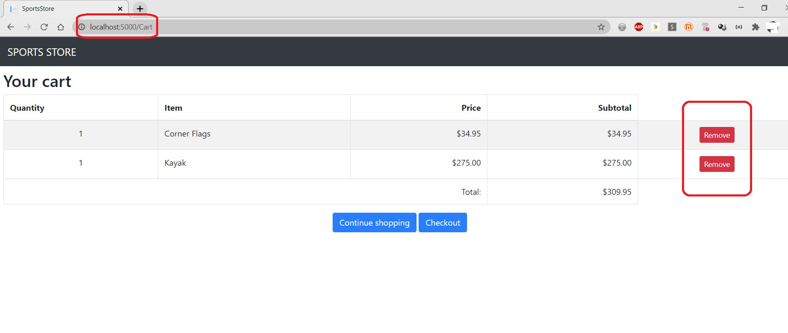
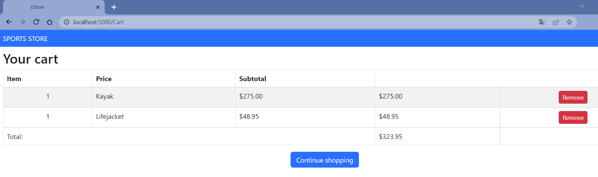
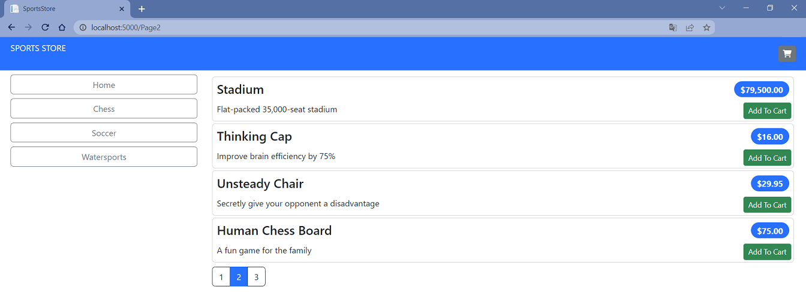
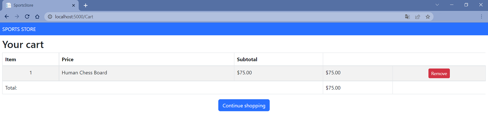
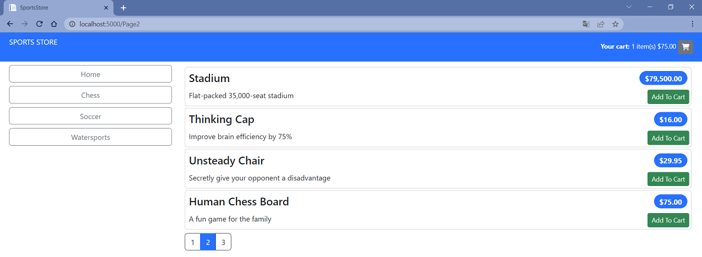
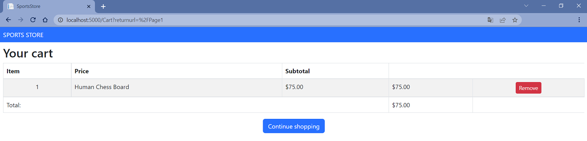
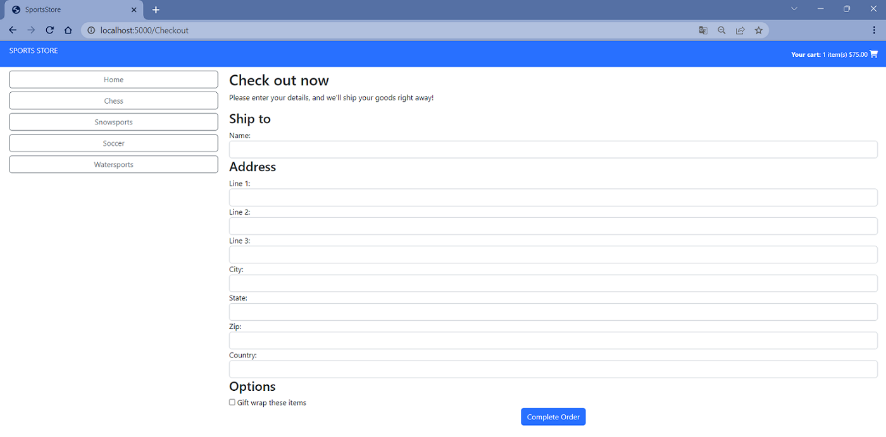
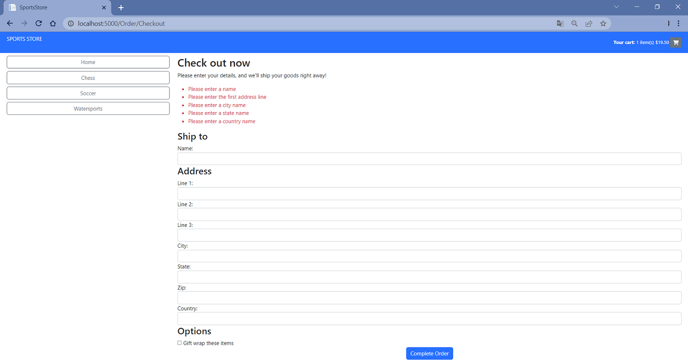
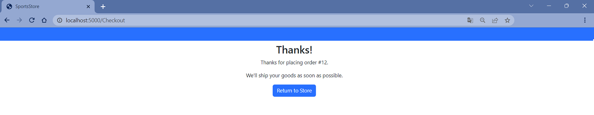

#  Sports Store Application. Part 3

## Description

Complete shopping cart development with a simple checkout process.

## Implementation details

<details>
<summary>

**Refining the Cart Model with a Service**
</summary>

- Go to the cloned repository of the previous step `Sport Store Application. Part 2`. 

- Switch to the `sports-store-application-3` branch and do a fast-forward merge according to changes from the `main` branch.

```
$ git checkout sports-store-application-3

$ git merge main --ff

```
- Continue your work in Visual Studio or other IDE.

- Build project, run application and request http://localhost:5000/. All functionalities implemented in the previous step should work.

- To can override the members of the `Cart` class apply the `virtual` keyword to the `AddItem`, `RemoveLine`, `Clear` methods of the `Cart` class

```
namespace SportsStore.Models
{
    public class Cart
    {
        . . .

      ➥public virtual void AddItem(Product product, int quantity)
        {
            . . .
        }

      ➥public virtual void RemoveLine(Product product)
        {
            . . .
        }

      ➥public virtual void Clear()
        {
            . . .
        }
    }
}.Re
```
- Add a `SessionCart` class to `SessionCart.cs` file to the `Models` folder.

```
using Newtonsoft.Json;
using SportsStore.Infrastructure;

namespace SportsStore.Models
{
  ➥public class SessionCart : Cart
    {
        public static Cart GetCart(IServiceProvider services)
        {
            ISession? session = services.GetRequiredService<IHttpContextAccessor>().HttpContext?.Session;
            SessionCart cart = session?.GetJson<SessionCart>("Cart") ?? new SessionCart();
            cart.Session = session;
            return cart;
        }

        [JsonIgnore]
        public ISession? Session { get; set; }

        public override void AddItem(Product product, int quantity)
        {
            base.AddItem(product, quantity);
            Session?.SetJson("Cart", this);
        }

        public override void RemoveLine(Product product)
        {
            base.RemoveLine(product);
            Session?.SetJson("Cart", this);
        }

        public override void Clear()
        {
            base.Clear();
            Session?.Remove("Cart");
        }
    }
}        
```
-  Register a service for the `Cart` class in the `Progrem.cs` file.

```
  . . .
  
  builder.Services.AddSession();
➥builder.Services.AddScoped<Cart>(SessionCart.GetCart);
➥builder.Services.AddSingleton<IHttpContextAccessor, HttpContextAccessor>();
. . .
        
```     
- Simplify the `CartController` class where `Cart` objects are used.

```
using Microsoft.AspNetCore.Mvc;
using SportsStore.Infrastructure;
using SportsStore.Models;
using SportsStore.Models.Repository;
using SportsStore.Models.ViewModels;

namespace SportsStore.Controllers
{
    public class CartController : Controller
    {
        private IStoreRepository repository;

      ➥public CartController(IStoreRepository repository, Cart cart)
        {
            this.repository = repository;
            this.Cart = cart;
        }

      ➥public Cart Cart { get; set; }

        [HttpGet]
        public IActionResult Index(string returnUrl)
        {
            return View(new CartViewModel
            {
                ReturnUrl = returnUrl ?? "/",
                Cart = this.Cart
            });
        }

        [HttpPost]
      ➥public IActionResult Index(long productId, string returnUrl)
        {
            Product? product = repository.Products.FirstOrDefault(p => p.ProductId == productId);

            if (product != null)
            {
                this.Cart.AddItem(product, 1);

                return View(new CartViewModel 
                {
                    Cart = this.Cart, 
                    ReturnUrl = returnUrl 
                });
            }

            return RedirectToAction("Index", "Home");
        }
    }
}
```

- Restart ASP.NET Core and request http://localhost:5000/.



- Add and view changes and than commit.

```
$ git status
$ git add *.cs *.csproj *.cshtml
$ git diff --staged
$ git commit -m "Refining the Cart Model with a Service."
```
</details>

<details>
<summary>

**Completing the Cart Functionality**
</summary>

- To remove items from the cart add to the `Index.cshtml` Razor View file from `SportsStore/Views/Cart` folder a `Remove` button  that will submit an HTTP POST request.

```
. . .
@foreach (var line in Model.Cart.Lines)
{
    <tr>
        . . .
        <td class="text-right">
            @((line.Quantity * line.Product.Price).ToString("c"))
        </td>
      ➥<td class="text-center">
            <form method="post" asp-action="Remove" asp-controller="Cart">
                <input type="hidden" name="ProductID" value="@line.Product.ProductId"/>
                <input type="hidden" name="returnUrl" value="@Model?.ReturnUrl"/>
                <button type="submit" class="btn btn-sm btn-danger">
                    Remove
                </button>
            </form>
        </td>
    </tr>
}
. . .
```

- Add a `Remove` action method to the `CartController` class.

```
using Microsoft.AspNetCore.Mvc;
using SportsStore.Infrastructure;
using SportsStore.Models;
using SportsStore.Models.Repository;
using SportsStore.Models.ViewModels;

namespace SportsStore.Controllers
{
    public class CartController : Controller
    {
        . . .

        [HttpPost]
        [Route("Cart/Remove")]
      ➥public IActionResult Remove(long productId, string returnUrl)
        {
            Cart.RemoveLine(Cart.Lines.First(cl => cl.Product.ProductId == productId).Product);
            return View("Index", new CartViewModel
            {
                Cart = Cart,
                ReturnUrl = returnUrl ?? "/"
            });
        }
        . . . 
    }
} 
```
- Add new `remove` route to the `Program` file.

```
. . .
  
  app.MapControllerRoute(
      "default",
      "/",
      new { Controller = "Home", action = "Index" });
  
➥app.MapControllerRoute(
      "remove",
      "Remove",
      new { Controller = "Cart", action = "Remove" });
  . . .
```
- Restart ASP.NET Core and request http://localhost:5000/Cart



- Add a widget that summarizes the contents of the cart and that can be clicked to display the cart contents throughout the application. Use the `Font Awesome` package, which is an excellent set of open source icons that are integrated into applications as fonts, where each character in the font is a different image (see http://fortawesome.github.io/Font-Awesome). To install the [client-side](https://docs.microsoft.com/en-us/aspnet/core/client-side/libman/libman-cli?view=aspnetcore-3.1) package, use a PowerShell command prompt to run the command (or use [Visual Studio possibilities](https://docs.microsoft.com/en-us/aspnet/core/client-side/libman/libman-vs?view=aspnetcore-6.0))

```
libman install font-awesome -d wwwroot/lib/font-awesome

```

The `libman.json` file looks like this (always check for up-to-date versions of the libraries you use)

```
{
  "version": "1.0",
  "defaultProvider": "cdnjs",
  "libraries": [
    {
      "library": "bootstrap@5.2.0",
      "destination": "wwwroot/lib/bootstrap"
    },
    {
      "provider": "cdnjs",
      "library": "font-awesome@6.1.2",
      "destination": "wwwroot/lib/font-awesome/"
    }
  ]
}
```

- Add a `CartSummaryViewComponent` class to the `CartSummaryViewComponent.cs` file to the `Components` folder.

```
namespace SportsStore.Components
{
  ➥public class CartSummaryViewComponent : ViewComponent
    {
        private Cart cart;

        public CartSummaryViewComponent(Cart cart)
        {
            this.cart = cart;
        }

        public IViewComponentResult Invoke()
        {
            return View(cart);
        }
    }
}
```

- Created the `Views/Shared/Components/CartSummary` folder and add to it a View Component named `Default.cshtml` with the following content.

```
@model Cart

<div class="">
    @if (Model.Lines.Any())
    {
        <small class="navbar-text">
            <b>Your cart:</b>
            @Model?.Lines.Sum(x => x.Quantity) item(s)
            @Model?.ComputeTotalValue().ToString("c")
        </small>
    }
    <a asp-route="shoppingCart"
       asp-route-returnurl="@ViewContext.HttpContext.Request.PathAndQuery()">
        <i class="fa fa-shopping-cart"></i>
    </a>
</div>
```

- To display a button with the Font Awesome cart icon and, if there are items in the cart, provides a snapshot that details the number of items and their total value, add the `Cart Summary` to the `_Layout.cshtml` file to the `Views/Shared` folder.

```
<!DOCTYPE html>
<html>
<head>
    <meta name="viewport" content="width=device-width" />
    <title>SportsStore</title>
    <link href="/lib/bootstrap/css/bootstrap.min.css" rel="stylesheet" />
    <link href="/lib/font-awesome/css/all.min.css" rel="stylesheet" />
</head>
<body>
    <div class="bg-primary text-white p-2">
        <div class="container-fluid">
            <div class="row">
                <div class="col navbar-brand">SPORTS STORE</div>
                <div class="col-6 navbar-text text-end">
                  ➥<vc:cart-summary />
                </div>
            </div>
        </div>
    </div>
    <div class="row m-1 p-1">
        <div id="categories" class="col-3">
            <vc:navigation-menu />
        </div>
        <div class="col-9">
            @RenderBody()
        </div>
    </div>
</body>
</html>
```

- Restart ASP.NET Core and request http://localhost:5000/Products/Page2. 

Add `Human Chess Board`.



Click `Continue shopping button`.



The widget that summarizes the contents of the cart looks like this.



If you press the cart icon, you will see summarizes the contents of the cart in details.



- Add and view changes and than commit.

```
$ git status
$ git add *.cs *.cshtml *.json *.csproj
$ git diff --staged
$ git commit -m "Completing the Cart Functionality."
```
</details>

<details>
<summary>

**Submitting Orders**

</summary>

- To represent the shipping details for a customer add a `Order.cs` class file to the `Models` folder.

```
using System.ComponentModel.DataAnnotations;
using Microsoft.AspNetCore.Mvc.ModelBinding;

namespace SportsStore.Models
{
  ➥public class Order
    {
        [BindNever]
        public int OrderId { get; set; }

        [BindNever]
        public ICollection<CartLine> Lines { get; set; } = new List<CartLine>();

        [Required(ErrorMessage = "Please enter a name")]
        public string? Name { get; set; }

        [Required(ErrorMessage = "Please enter the first address line")]
        public string? Line1 { get; set; }

        public string? Line2 { get; set; }

        public string? Line3 { get; set; }

        [Required(ErrorMessage = "Please enter a city name")]
        public string? City { get; set; }

        [Required(ErrorMessage = "Please enter a state name")]
        public string? State { get; set; }

        public string? Zip { get; set; }

        [Required(ErrorMessage = "Please enter a country name")]
        public string? Country { get; set; }

        public bool GiftWrap { get; set; }
    }
}
```

-  Add a `Checkout` button to the cart view to the `Index.cshtml` file to the `SportsStore/Views/Cart` folder.

```
@model CartViewModel

@{
    Layout = "_CartLayout";
}

<h2>Your cart</h2>
<table class="table table-bordered table-striped">
. . .
</table>
<div class="text-center">
    <a class="btn btn-primary" href="@Model.ReturnUrl">Continue shopping</a>
  ➥<a class="btn btn-primary" asp-route="checkout">Checkout</a>
</div>

```

- Add a `OrderController` class with a `Checkout` action method to the `OrderController.cs` file to the `Controllers` folder.

```
using Microsoft.AspNetCore.Mvc;
using SportsStore.Models;
using SportsStore.Models.Repository;

namespace SportsStore.Controllers
{
  ➥public class OrderController : Controller
    {
        public ViewResult Checkout() => View(new Order());
    }
}
```

- Create the `Views/Order` folder and added to it a Razor View called `Checkout.cshtml`.

```   
@model Order

<h2>Check out now</h2>
<p>Please enter your details, and we'll ship your goods right away!</p>
<form asp-action="Checkout" method="post">
    <h3>Ship to</h3>
    <div class="form-group">
        <label>Name:</label><input asp-for="Name" class="form-control" />
    </div>
    <h3>Address</h3>
    <div class="form-group">
        <label>Line 1:</label><input asp-for="Line1" class="form-control" />
    </div>
    <div class="form-group">
        <label>Line 2:</label><input asp-for="Line2" class="form-control" />
    </div>
    <div class="form-group">
        <label>Line 3:</label><input asp-for="Line3" class="form-control" />
    </div>
    <div class="form-group">
        <label>City:</label><input asp-for="City" class="form-control" />
    </div>
    <div class="form-group">
        <label>State:</label><input asp-for="State" class="form-control" />
    </div>
    <div class="form-group">
        <label>Zip:</label><input asp-for="Zip" class="form-control" />
    </div>
    <div class="form-group">
        <label>Country:</label><input asp-for="Country" class="form-control" />
    </div>
    <h3>Options</h3>
    <div class="checkbox">
        <label>
            <input asp-for="GiftWrap" /> Gift wrap these items
        </label>
    </div>
    <div class="text-center">
        <input class="btn btn-primary" type="submit" value="Complete Order" />
    </div>
</form>
```

- Add `checkout` route to the `Program.cs` file

```
  . . .
  app.MapControllerRoute(
      "default",
      "/",
      new { Controller = "Home", action = "Index" });
 
➥app.MapControllerRoute(
      "checkout",
      "Checkout",
      new { Controller = "Order", action = "Checkout" });

  app.MapControllerRoute(
      "remove",
      "Remove",
      new { Controller = "Cart", action = "Remove" });

  . . .    
```
    
- Restart ASP.NET Core and request http://localhost:5000/Checkout.



- Add and view changes and than commit.

```
$ git status
$ git add *.cs *.cshtml
$ git diff --staged
$ git commit -m "Submitting Orders."

```

</details>

<details>
<summary>

**Implementing Order Processing**

</summary>

- Add a new `Orders` property to the `StoreDbContext` database context class.

```
namespace SportsStore.Models
{
    public class StoreDbContext : DbContext
    {
        public StoreDbContext(DbContextOptions<StoreDbContext> options)
            : base(options) { }

        public DbSet<Product> Products => this.Set<Product>();

      ➥public DbSet<Order> Orders => Set<Order>();
    }
}
```

-  To create the migration, use a PowerShell command prompt to run the command.

```
dotnet ef migrations add Orders

```
_This migration will be applied automatically when the application starts because the `SeedData` calls the `Migrate` method provided by Entity Framework Core._

- Follow the same pattern that was used for the `Product` repository for providing access to `Order` objects. Add the `IOrderRepository.cs` interface file to the `Models/Repository` folder.

```
namespace SportsStore.Models.Repository
{
  ➥public interface IOrderRepository
    {
        IQueryable<Order> Orders { get; }

        void SaveOrder(Order order);
    }
}
```

- To implement the order repository interface, add a `EFOrderRepository` class to the `EFOrderRepository.cs` file to the `Models/Repository` folder.

```
using Microsoft.EntityFrameworkCore;

namespace SportsStore.Models.Repository
{
  ➥public class EFOrderRepository : IOrderRepository
    {
        private StoreDbContext context;

        public EFOrderRepository(StoreDbContext context)
        {
            this.context = context;
        }

        public IQueryable<Order> Orders => context.Orders
            .Include(o => o.Lines)
            .ThenInclude(l => l.Product);

        public void SaveOrder(Order order)
        {
            context.AttachRange(order.Lines.Select(l => l.Product));

            if (order.OrderId == 0)
            {
                context.Orders.Add(order);
            }

            context.SaveChanges();
        }
    }
}
```
This class implements the `IOrderRepository` interface using Entity Framework Core, allowing the set of `Order` objects that have been stored to be retrieved and allowing for orders to be created or changed.

- Register the `Order Repository Service` in the `Program.cs` file. 

```
. . .
  builder.Services.AddScoped<IStoreRepository, EFStoreRepository>();
➥builder.Services.AddScoped<IOrderRepository, EFOrderRepository>();
  builder.Services.AddDistributedMemoryCache();
  builder.Services.AddSession();
. . .
```   
- To complete the `OrderController` class modify the constructor so that it receives the services it requires to process an order and add an action method that will handle the HTTP form POST request when the user clicks the Complete `Order button`. 

```
using Microsoft.AspNetCore.Mvc;
using SportsStore.Models;
using SportsStore.Models.Repository;

namespace SportsStore.Controllers
{
    public class OrderController : Controller
    {
      ➥private IOrderRepository orderRepository;

      ➥private Cart cart;

      ➥public OrderController(IOrderRepository orderRepository, Cart cart)
        {
            this.orderRepository = orderRepository;
            this.cart = cart;
        }

      ➥public ViewResult Checkout() => View(new Order());

        [HttpPost]
      ➥public IActionResult Checkout(Order order)
        {
            if (!cart.Lines.Any())
            {
                ModelState.AddModelError("", "Sorry, your cart is empty!");
            }

            if (ModelState.IsValid)
            {
                order.Lines = cart.Lines.ToArray();
                orderRepository.SaveOrder(order);
                cart.Clear();
                return View("Completed", order.OrderId);
            }
            
            return View();
        }
    }
}

```
- Add a Validation Summary to the `Checkout.cshtml` Razor View file.

```
  @model Order
  
  <h2>Check out now</h2>
  <p>Please enter your details, and we'll ship your goods right away!</p>
➥<div asp-validation-summary="All" class="text-danger"></div>
  <form asp-action="Checkout" method="post">
. . .
```
- Restart ASP.NET Core and request http://localhost:5000/Checkout. 



- To complete the checkout process, create a `Completed.cshtml` Razor View that displays a thank-you message with a summary of the orders

```
@model int

@{
    this.Layout = "_CartLayout";
}

<div class="text-center">
    <h2>Thanks!</h2>
    <p>Thanks for placing order #@Model.</p>
    <p>We'll ship your goods as soon as possible.</p>
    <a class="btn btn-primary" asp-route="default">Return to Store</a>
</div>
```
and `Checkout` action method to the `OrderController` class.

```
using Microsoft.AspNetCore.Mvc;
using SportsStore.Models;
using SportsStore.Models.Repository;

namespace SportsStore.Controllers
{
    public class OrderController : Controller
    {
        private IOrderRepository orderRepository;

        private Cart cart;

        public OrderController(IOrderRepository orderRepository, Cart cart)
        {
            this.orderRepository = orderRepository;
            this.cart = cart;
        }

        public ViewResult Checkout() => View(model: new Order());

        [HttpPost]
      ➥public IActionResult Checkout(Order order)
        {
            if (!cart.Lines.Any())
            {
                ModelState.AddModelError(key: string.Empty, errorMessage: "Sorry, your cart is empty!");
            }

            if (ModelState.IsValid)
            {
                order.Lines = cart.Lines.ToArray();
                orderRepository.SaveOrder(order: order);
                cart.Clear();
                return View(viewName: "Completed", model: order.OrderId);
            }

            return View();
        }
    }
}

```

- Restart ASP.NET Core and request http://localhost:5000/Checkout. 



- Add and view changes and than commit.

```
$ git status
$ git add *.cs *.csproj *.cshtml
$ git diff --staged
$ git commit -m "Implementing Order Processing."
```

- Push the local branch to the remote branch.

```
$ git push --set-upstream origin sports-store-application-3

```
- Switch to the `main` branch and do a merge according to changes from the `sports-store-application-3` branch.

```
$ git checkout main

$ git merge sports-store-application-3
```
- Push the changes from the local `main` branch to the remote branch.

```
$ git push

```
- Go to the `Sports Store Application. Step 4`. (branch `sports-store-application-4`).


</details>

## Additional Materials

<details><summary>References
</summary> 

1. [Minimal APIs overview](https://docs.microsoft.com/en-us/aspnet/core/fundamentals/minimal-apis?view=aspnetcore-6.0)
1. [Get started with ASP.NET Core MVC](https://docs.microsoft.com/en-us/aspnet/core/tutorials/first-mvc-app/start-mvc?view=aspnetcore-6.0&tabs=visual-studio)
1. [Controllers](https://jakeydocs.readthedocs.io/en/latest/mvc/controllers/index.html)
1. [Views](https://jakeydocs.readthedocs.io/en/latest/mvc/views/index.html)
1. [Models](https://jakeydocs.readthedocs.io/en/latest/mvc/models/index.html)
1. [ASP.NET Core MVC with EF Core - tutorial series](https://docs.microsoft.com/en-us/aspnet/core/data/ef-mvc/?view=aspnetcore-6.0)
1. [Persist and retrieve relational data with Entity Framework Core](https://docs.microsoft.com/en-us/learn/modules/persist-data-ef-core/?view=aspnetcore-6.0)

</details>

<details><summary>[Pro ASP.NET Core 6. Develop Cloud-Ready Web Applications Using MVC, Blazor, and Razor Pages 9th ed. Edition by Adam Freeman](https://www.amazon.com/Pro-ASP-NET-Core-Cloud-Ready-Applications/dp/1484279565/).
</summary> 

1. Part Ⅰ. Chapeter 9. SportsStore: Completing the Cart.
1. Part Ⅱ. Chapeter 13. Using URL Routing.
1. Part Ⅱ. Chapeter 14. Using Dependency Injection.
1. Part Ⅱ. Chapeter 15. Using the Platform Features. Part 1.
1. Part Ⅱ. Chapeter 16. Using the Platform Features. Part 2.
1. Part Ⅱ. Chapeter 17. Working with Data.
1. Part Ⅲ. Chapeter 21. Using Controllers with Views. Part 1.
1. Part Ⅲ. Chapeter 22. Using Controllers with Views. Part 2.
1. Part Ⅲ. Chapeter 24. Using View Components.
1. Part Ⅲ. Chapeter 28. Using Model Binding.
1. Part Ⅲ. Chapeter 29. Using Model Validation.

</details>
